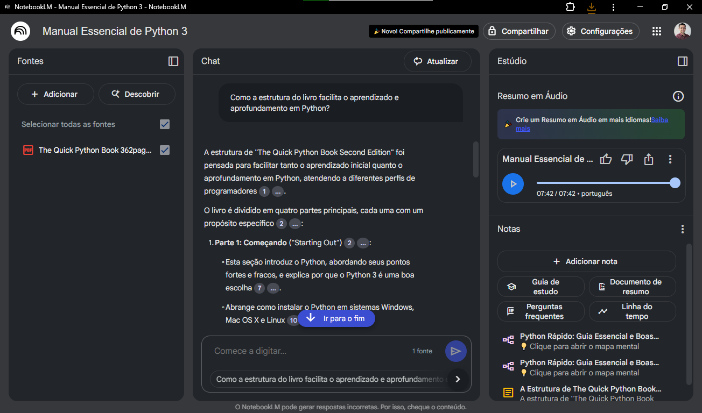

# Natural ou Fake Natty? Como Vencer na Era das IAs Generativas
# Título do Projeto Extremamente Aesthetic ;)
Podcast "Manual Essencial de Python3"

## 📒 Descrição

Este projeto é um PODCAST, feito no NotebookLM, Nome do Podcast "Manual Essencial de Python3", baseado no livro "The Quick Python Book"

## 🤖 Tecnologias Utilizadas

 Usei o NotebookLM (para o podcast etc) e o Gemini (para o conteúdo)
 - NotebookLM é uma ferramenta do Google AI que te ajuda a entender e trabalhar com grandes quantidades de informação, como documentos e anotações, permitindo resumir, fazer perguntas e organizar o conteúdo de forma mais eficiente.

## 🧐 Processo de Criação

- Parti do pdf do livro "The Quick Python Book", versão em inglês, enviei para o NotebookLM e ele gerou o podcast e resumos.

## 🚀 Resultados

- [Link do Podcast "Manual Essencial de Python3" sobre o livro "The Quick Python Book"](https://notebooklm.google.com/notebook/cb37e0f3-d086-43b1-a6f6-4d59895281cd/audio)

O NotebookLM permite criar um audio, baseado no texto, pdf, utilizado, o diálogo é original e pode ser em qualquer idioma, inclusive com sutaque regional, no áudio parece ser a maneira de se falar no Rio de Janeiro.

Abaixo, compartilho o resumo, também criado no NotebookLM:

A estrutura de "The Quick Python Book Second Edition" foi pensada para facilitar tanto o aprendizado inicial quanto o aprofundamento em Python, atendendo a diferentes perfis de programadores.

O livro é dividido em quatro partes principais, cada uma com um propósito específico:
1. Parte 1: Começando ("Starting Out"):
Esta seção introduz o Python, abordando seus pontos fortes e fracos, e explica por que o Python 3 é uma boa escolha.
◦ Abrange como instalar o Python em sistemas Windows, Mac OS X e Linux.
◦ Apresenta o IDLE, o ambiente de desenvolvimento integrado do Python, e o modo interativo básico.
◦ O Capítulo 3, "Uma Visão Geral Rápida do Python", é um levantamento de alto nível da sintaxe e dos recursos do Python, projetado para oferecer uma perspectiva inicial e rápida para quem busca uma introdução veloz.

2. Parte 2: Os Essenciais ("The Essentials"):
◦ É considerada o "coração do livro".
◦ Cobre os elementos fundamentais para obter um conhecimento prático de Python como linguagem de programação de propósito geral.
◦ Os capítulos são projetados para que leitores iniciantes em Python possam avançar sequencialmente, absorvendo os pontos-chave da linguagem.
◦ Inclui seções mais avançadas dentro dos capítulos, permitindo que o leitor retorne para encontrar informações completas sobre uma construção ou tópico específico.
◦ Aborda tópicos como os fundamentos absolutos, tipos de dados (listas, tuplas, conjuntos, strings, dicionários), controle de fluxo, funções, módulos, uso do sistema de arquivos, leitura/escrita de arquivos, exceções e programação orientada a objetos.

3. Parte 3: Recursos Avançados da Linguagem ("Advanced Language Features"):
◦ Introduz recursos mais avançados da linguagem Python que, embora não sejam essenciais para o uso básico, são de grande ajuda para um programador Python sério.
◦ Inclui expressões regulares, pacotes, tipos de dados como objetos e recursos avançados de programação orientada a objetos.

4. Parte 4: Onde Você Pode Ir a Partir Daqui? ("Where Can You Go From Here?"):
◦ Descreve tópicos mais avançados ou especializados que vão além da sintaxe estrita da linguagem.
◦ Os leitores podem escolher ler esses capítulos ou não, dependendo de suas necessidades.
◦ Aborda tópicos como testes de código (doctests e unit tests), migração do Python 2 para o Python 3, uso de bibliotecas Python (a biblioteca padrão e módulos externos), e programação de rede, web e banco de dados.

Sugestões de Roteiro de Aprendizado:
• Para iniciantes em Python: O livro sugere começar lendo o Capítulo 3 para ter uma visão geral e, em seguida, trabalhar sequencialmente pelos capítulos da Parte 2. É recomendado praticar os exemplos interativos para reforçar os conceitos. O livro também indica que é possível pular os capítulos 15 (Classes e OOP) ou 16 (GUIs) se não forem relevantes para a aplicação desejada.
• Para aqueles familiarizados com Python: Também é recomendado começar com o Capítulo 3, que serve como uma boa revisão e introduz as diferenças entre Python 3 e versões anteriores. Isso ajuda a determinar se o leitor está pronto para os capítulos avançados das Partes 3 e 4.
• Para programadores experientes em outras linguagens: O livro indica que muitos podem aprender o essencial no Capítulo 3 e, a partir daí, explorar os módulos da biblioteca padrão listados no Capítulo 23 e a Referência da Biblioteca Python.

Em resumo, a estrutura do livro é flexível e abrangente: começa com uma visão geral e os fundamentos para iniciantes, avança para recursos mais sofisticados e culmina em aplicações práticas e tópicos especializados, permitindo que cada leitor personalize sua jornada de aprendizado de acordo com seu nível de experiência e interesses.

## 💭 Reflexão (Opcional)

- Foi muito interessante a facilidade de se conseguir um diálogo, totalmente focado no livro que estou estudando e criado pela IA.

### Exemplos e Insigths

- 

## Links Interessantes

- [Link do Podcast "Manual Essencial de Python3" sobre o livro "The Quick Python Book"](https://notebooklm.google.com/notebook/cb37e0f3-d086-43b1-a6f6-4d59895281cd/audio)